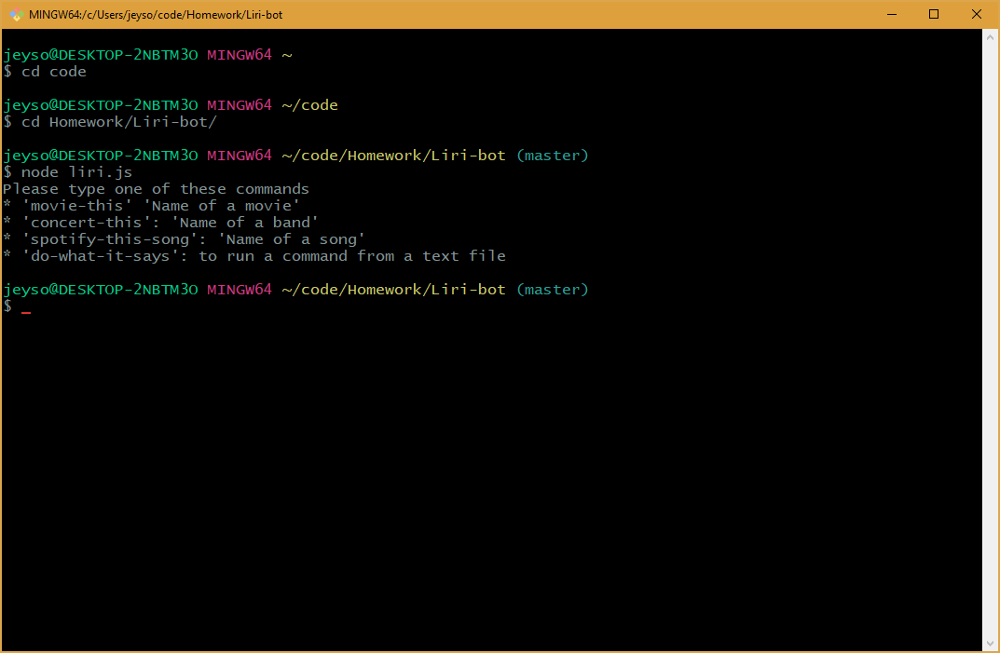
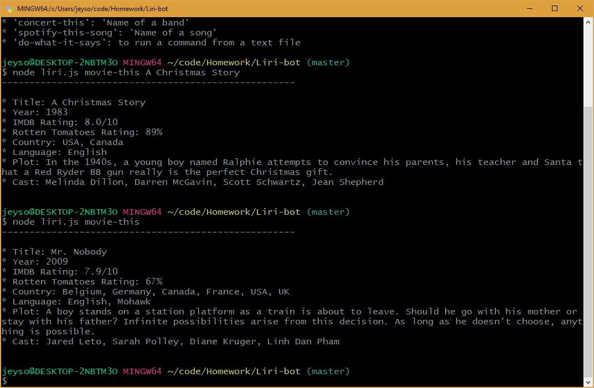

# Liri-bot

LIRI is like iPhone's SIRI. However, while SIRI is a Speech Interpretation and Recognition Interface, LIRI is a Language Interpretation and Recognition Interface. LIRI is command line node app that takes in parameters and gives you back data.

In order to use this app the user must start from a command line using Node. In the example below the user when the user enters the command "node liri.js" it returns some basic instructions.

In the next example the user can type the "movie-this" command and "the name of the movie" to view information about a movie. If the user does not type a name of a movie, it will always return results for the movie "Mr. Nobody", as seen below.

---

**...more to come. check back for additional features**

I still need to add the ability to search for concerts, songs, and read from a text file.

